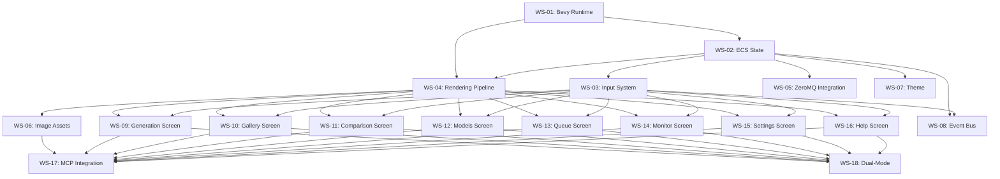

# RFD 0003: bevy_ratatui Migration Strategy

**Status**: Draft
**Author**: Claude (AI Assistant)
**Date**: 2025-11-14
**Related**: RFD 0002 (Image Preview Architecture)

## Executive Summary

This RFD proposes a complete migration from pure ratatui to **bevy_ratatui** (Phase 3 from RFD 0002), implementing a Bevy ECS-based architecture for the DGX-Pixels TUI. The migration will be executed through **18 isolated workstreams** organized into 5 orchestration layers to prevent merge conflicts while delivering incremental value.

**Timeline**: 4-6 weeks (18 workstreams, 2-3 parallel)
**Risk Level**: High (major architectural change)
**Strategic Value**: ⭐⭐⭐⭐⭐ (perfect alignment with Bevy integration goals)

## Context

### Current Architecture (Pure ratatui)

```rust
// main.rs - Manual event loop
async fn run_app(terminal: &mut Terminal<B>, app: &mut App) -> Result<()> {
    loop {
        // 1. Manual ZMQ polling
        // 2. Manual preview manager polling
        // 3. Direct rendering: ui::render(terminal, app)?
        // 4. Manual event handling: event::poll()
        // 5. Manual state mutations
    }
}
```

**Pain Points**:
- ❌ 300-line manual event loop
- ❌ Monolithic `App` struct (all state in one place)
- ❌ Imperative event handling
- ❌ Manual async task coordination
- ❌ Sixel preview with incomplete encoding
- ❌ No GPU acceleration for image rendering

### Target Architecture (bevy_ratatui)

```rust
// main.rs - Bevy ECS
fn main() {
    App::new()
        .add_plugins((
            MinimalPlugins.set(ScheduleRunnerPlugin::run_loop(Duration::from_secs_f32(1.0/60.0))),
            RatatuiPlugins::default(),
            DgxPixelsPlugin,
        ))
        .add_systems(PreUpdate, (handle_input, poll_zmq, poll_previews))
        .add_systems(Update, (update_jobs, update_gallery, update_comparison))
        .add_systems(PostUpdate, render_all_screens)
        .run();
}
```

**Benefits**:
- ✅ Bevy ECS handles scheduling, parallelism, and lifecycle
- ✅ State decomposed into Resources + Components
- ✅ Message-based input handling
- ✅ GPU-accelerated image rendering with Bevy assets
- ✅ Natural async integration (Bevy's async executor)
- ✅ Foundation for MCP integration (Bevy asset hot-reloading)
- ✅ Dual-mode: terminal + native window support

## Migration Strategy: Incremental Coexistence

The migration follows a **"strangler fig" pattern** where new Bevy code grows alongside old ratatui code:

### Phase 1: Foundation (Weeks 1-2)
- **Goal**: Bevy runtime operational, ratatui still working
- **Approach**: Add Bevy as secondary runtime, keep old code functional
- **Validation**: Both systems coexist, no user-visible changes

### Phase 2: System Migration (Weeks 2-4)
- **Goal**: Core systems (input, rendering, ZMQ) migrated to Bevy
- **Approach**: Replace subsystems one at a time, feature-flagged
- **Validation**: Each screen works in new system before old code removed

### Phase 3: Screen Migration (Weeks 4-5)
- **Goal**: All UI screens migrated to Bevy-rendered ratatui widgets
- **Approach**: Parallel migration of 7 screens (isolated files)
- **Validation**: Feature parity verified per screen

### Phase 4: Polish & Integration (Week 6)
- **Goal**: GPU image rendering, MCP integration, cleanup
- **Approach**: Remove old code, add Bevy-native features
- **Validation**: Performance targets met, all tests passing

## Workstream Architecture

### Orchestration Hierarchy

```
Meta-Orchestrator: TUI-Modernization
├── Foundation Orchestrator (Weeks 1-2)
│   ├── WS-01: Bevy Runtime Setup
│   ├── WS-02: ECS State Migration
│   ├── WS-03: Input System
│   └── WS-04: Rendering Pipeline
│
├── Core Systems Orchestrator (Weeks 2-3)
│   ├── WS-05: ZeroMQ Integration
│   ├── WS-06: Image Asset System
│   ├── WS-07: Theme & Styling
│   └── WS-08: Event Bus
│
├── Screen Migration Orchestrator (Weeks 3-5)
│   ├── WS-09: Generation Screen
│   ├── WS-10: Gallery Screen
│   ├── WS-11: Comparison Screen
│   ├── WS-12: Models Screen
│   ├── WS-13: Queue Screen
│   ├── WS-14: Monitor Screen
│   ├── WS-15: Settings Screen
│   └── WS-16: Help Screen
│
├── Integration Orchestrator (Week 5-6)
│   ├── WS-17: MCP Integration
│   └── WS-18: Dual-Mode Rendering
│
└── Validation Orchestrator (Continuous)
    └── Testing & Benchmarking
```

### Workstream Isolation Strategy

Each workstream is isolated by:
1. **File Scope**: Touches specific files only
2. **Module Boundary**: Works within defined module
3. **Feature Flag**: Gated by `cfg(feature = "bevy_migration")`
4. **API Contract**: Clear interfaces between workstreams
5. **Test Coverage**: Integration tests per workstream

## Detailed Workstream Specifications

---

### WS-01: Bevy Runtime Setup

**Orchestrator**: Foundation
**Duration**: 3-4 days
**Dependencies**: None (foundation workstream)
**Risk**: Low

**Scope**:
- Add `bevy` and `bevy_ratatui` dependencies to `Cargo.toml`
- Create `rust/src/bevy_app/mod.rs` (new module, zero conflicts)
- Implement dual-mode main: old ratatui OR new Bevy (feature-flagged)
- Configure Bevy with `MinimalPlugins` + `RatatuiPlugins`
- Set up 60Hz update loop

**Files Created**:
```
rust/src/bevy_app/
├── mod.rs           # Bevy app entry point
├── plugins.rs       # DgxPixelsPlugin definition
└── config.rs        # Bevy configuration
```

**Files Modified**:
```
rust/Cargo.toml      # Add dependencies
rust/src/main.rs     # Add feature-gated dual-mode entry
```

**Acceptance Criteria**:
- ✅ `cargo run --features bevy_migration` launches Bevy runtime
- ✅ Terminal enters raw mode and shows blank screen
- ✅ Old ratatui app still works: `cargo run` (no feature flag)
- ✅ 60 FPS maintained in both modes
- ✅ Clean shutdown on Ctrl+C

**Testing**:
```bash
# Test old mode
cargo run

# Test new Bevy mode
cargo run --features bevy_migration

# Benchmark frame time
cargo run --features bevy_migration --release
```

---

### WS-02: ECS State Migration

**Orchestrator**: Foundation
**Duration**: 4-5 days
**Dependencies**: WS-01
**Risk**: Medium

**Scope**:
- Decompose `app::App` struct into Bevy Resources
- Create component types for entities
- Implement state accessors (bridges during transition)
- Add state initialization systems

**Files Created**:
```
rust/src/bevy_app/
├── resources/
│   ├── mod.rs
│   ├── app_state.rs         # Main app state resource
│   ├── screen_state.rs      # Current screen tracking
│   ├── input_state.rs       # Input buffer, cursor
│   ├── job_state.rs         # Active jobs
│   └── gallery_state.rs     # Gallery images
├── components/
│   ├── mod.rs
│   ├── job.rs               # Job component
│   └── preview.rs           # Preview component
└── systems/
    ├── mod.rs
    └── state_init.rs        # State initialization system
```

**State Mapping**:
```rust
// OLD: Monolithic struct
pub struct App {
    current_screen: Screen,
    input_buffer: String,
    cursor_pos: usize,
    active_jobs: Vec<ActiveJob>,
    gallery_images: Vec<PathBuf>,
    // ... 20+ more fields
}

// NEW: Decomposed resources
#[derive(Resource)]
struct CurrentScreen(Screen);

#[derive(Resource)]
struct InputBuffer {
    text: String,
    cursor: usize,
}

#[derive(Resource)]
struct GalleryState {
    images: Vec<PathBuf>,
    selected: usize,
}

// Jobs become entities with components
#[derive(Component)]
struct Job {
    id: String,
    prompt: String,
    status: JobStatus,
}
```

**Files Modified**:
```
rust/src/app.rs              # Keep old App, add `impl From<App> for BevyResources`
rust/src/bevy_app/plugins.rs # Add state resources to plugin
```

**Acceptance Criteria**:
- ✅ All App state has Bevy resource equivalent
- ✅ Conversion function: `App → BevyResources` works
- ✅ State initialization system spawns correct initial state
- ✅ No runtime panics accessing resources
- ✅ Old ratatui mode unaffected

**Testing**:
```rust
#[cfg(test)]
mod tests {
    #[test]
    fn test_app_to_bevy_conversion() {
        let app = App::new();
        let (world, resources) = app.into_bevy_resources();

        assert!(world.contains_resource::<CurrentScreen>());
        assert!(world.contains_resource::<InputBuffer>());
        // ... validate all resources
    }
}
```

---

### WS-03: Input System

**Orchestrator**: Foundation
**Duration**: 3-4 days
**Dependencies**: WS-02
**Risk**: Medium

**Scope**:
- Replace crossterm event polling with Bevy message readers
- Implement input handling systems (keyboard, resize events)
- Map old `events::EventHandler` logic to Bevy systems
- Add input forwarding configuration

**Files Created**:
```
rust/src/bevy_app/systems/
├── input/
│   ├── mod.rs
│   ├── keyboard.rs          # Keyboard input system
│   ├── navigation.rs        # Screen navigation logic
│   └── text_entry.rs        # Text input handling
```

**Input System Architecture**:
```rust
use bevy_ratatui::event::KeyMessage;

fn handle_keyboard_input(
    mut messages: MessageReader<KeyMessage>,
    mut current_screen: ResMut<CurrentScreen>,
    mut input_buffer: ResMut<InputBuffer>,
    mut exit: EventWriter<AppExit>,
) {
    for message in messages.read() {
        match message.code {
            KeyCode::Char('q') if current_screen.0 != Screen::Generation => {
                exit.send(AppExit);
            }
            KeyCode::Char(c) if current_screen.0 == Screen::Generation => {
                input_buffer.text.push(c);
                input_buffer.cursor += 1;
            }
            KeyCode::Tab => {
                // Navigate screens
                current_screen.0 = current_screen.0.next();
            }
            // ... more input handling
            _ => {}
        }
    }
}
```

**Files Modified**:
```
rust/src/bevy_app/plugins.rs # Register input systems
```

**Files Preserved** (for gradual migration):
```
rust/src/events/             # Keep old event handling during transition
```

**Acceptance Criteria**:
- ✅ All keyboard shortcuts work in Bevy mode
- ✅ Text input functional in Generation screen
- ✅ Screen navigation (Tab, Shift+Tab) works
- ✅ Quit on 'q' works
- ✅ Resize events handled
- ✅ Input latency < 16ms (60 FPS)

**Testing**:
```rust
#[test]
fn test_keyboard_navigation() {
    let mut app = create_test_app();

    // Simulate Tab key
    app.world.send_message(KeyMessage { code: KeyCode::Tab, .. });
    app.update();

    let screen = app.world.resource::<CurrentScreen>();
    assert_eq!(screen.0, Screen::Comparison);
}
```

---

### WS-04: Rendering Pipeline

**Orchestrator**: Foundation
**Duration**: 4-5 days
**Dependencies**: WS-02
**Risk**: High

**Scope**:
- Implement Bevy rendering systems using `RatatuiContext::draw()`
- Create rendering dispatch system (routes to screen-specific renderers)
- Port existing ratatui widget code to Bevy systems
- Ensure 60 FPS rendering maintained

**Files Created**:
```
rust/src/bevy_app/systems/
├── render/
│   ├── mod.rs
│   ├── dispatch.rs          # Screen routing
│   ├── layout.rs            # Layout computation
│   └── widgets.rs           # Reusable widget helpers
```

**Rendering System Architecture**:
```rust
fn render_dispatch(
    mut ratatui_ctx: ResMut<RatatuiContext>,
    current_screen: Res<CurrentScreen>,
    // ... other resources
) -> Result<(), Box<dyn std::error::Error>> {
    ratatui_ctx.draw(|frame| {
        match current_screen.0 {
            Screen::Generation => render_generation_screen(frame, &state),
            Screen::Gallery => render_gallery_screen(frame, &state),
            Screen::Comparison => render_comparison_screen(frame, &state),
            // ... other screens
            _ => render_placeholder(frame),
        }
    })?;
    Ok(())
}
```

**Files Modified**:
```
rust/src/bevy_app/plugins.rs # Register rendering systems in PostUpdate
```

**Files Preserved** (for reference):
```
rust/src/ui/                 # Keep old rendering code as reference
```

**Acceptance Criteria**:
- ✅ All screens render in Bevy mode
- ✅ 60 FPS maintained (frame time < 16ms)
- ✅ Layout matches old ratatui version
- ✅ Theme colors consistent
- ✅ Status bar shows correct info
- ✅ No flickering or tearing

**Testing**:
```bash
# Benchmark rendering
cargo run --features bevy_migration --release -- --benchmark

# Visual regression test
cargo test --features bevy_migration test_render_snapshots
```

---

### WS-05: ZeroMQ Integration

**Orchestrator**: Core Systems
**Duration**: 3-4 days
**Dependencies**: WS-02
**Risk**: Medium

**Scope**:
- Integrate ZeroMQ client with Bevy's async runtime
- Create polling system for ZMQ responses/updates
- Implement job state update systems
- Add progress tracking components

**Files Created**:
```
rust/src/bevy_app/systems/
├── zmq/
│   ├── mod.rs
│   ├── poller.rs            # ZMQ polling system
│   ├── response_handler.rs  # Response processing
│   └── update_handler.rs    # Progress updates
```

**ZeroMQ System Architecture**:
```rust
#[derive(Resource)]
struct ZmqClientResource(Arc<ZmqClient>);

fn poll_zmq_responses(
    client: Res<ZmqClientResource>,
    mut commands: Commands,
    mut job_query: Query<(Entity, &mut Job)>,
) {
    // Poll for responses
    while let Some(response) = client.0.try_recv_response() {
        match response {
            Response::JobAccepted { job_id, .. } => {
                // Spawn job entity
                commands.spawn(Job {
                    id: job_id,
                    status: JobStatus::Queued,
                    ..default()
                });
            }
            Response::JobComplete { job_id, image_path, duration_s } => {
                // Update job entity
                for (entity, mut job) in job_query.iter_mut() {
                    if job.id == job_id {
                        job.status = JobStatus::Complete { image_path, duration_s };
                    }
                }
            }
            _ => {}
        }
    }
}
```

**Files Modified**:
```
rust/src/zmq_client.rs       # Make thread-safe (Arc<Mutex<>>)
rust/src/bevy_app/plugins.rs # Register ZMQ systems
```

**Acceptance Criteria**:
- ✅ ZMQ client initializes in Bevy app
- ✅ Responses processed in real-time
- ✅ Job state updates trigger UI refresh
- ✅ Progress updates flow correctly
- ✅ No deadlocks or race conditions
- ✅ Old ratatui mode still works

**Testing**:
```rust
#[tokio::test]
async fn test_zmq_job_lifecycle() {
    let mut app = create_test_app_with_zmq();

    // Submit job
    submit_test_job(&app);

    // Simulate response
    inject_zmq_response(&app, Response::JobAccepted { .. });
    app.update();

    // Verify job entity created
    let jobs: Vec<&Job> = app.world.query::<&Job>().iter(&app.world).collect();
    assert_eq!(jobs.len(), 1);
}
```

---

### WS-06: Image Asset System

**Orchestrator**: Core Systems
**Duration**: 4-5 days
**Dependencies**: WS-02, WS-04
**Risk**: High (replaces Sixel system)

**Scope**:
- Replace Sixel preview system with Bevy image assets
- Implement GPU-accelerated image rendering
- Create image loading and caching systems
- Add preview components for entities

**Files Created**:
```
rust/src/bevy_app/
├── assets/
│   ├── mod.rs
│   ├── image_loader.rs      # Async image loading
│   └── cache.rs             # Asset cache management
├── systems/
│   └── preview/
│       ├── mod.rs
│       ├── loader.rs        # Preview loading system
│       └── renderer.rs      # Image rendering system
└── components/
    └── preview_image.rs     # Preview component
```

**Image Asset Architecture**:
```rust
#[derive(Component)]
struct PreviewImage {
    asset_handle: Handle<Image>,
    path: PathBuf,
}

fn load_preview_images(
    mut commands: Commands,
    asset_server: Res<AssetServer>,
    job_query: Query<(Entity, &Job), Changed<Job>>,
) {
    for (entity, job) in job_query.iter() {
        if let JobStatus::Complete { image_path, .. } = &job.status {
            let handle = asset_server.load(image_path);
            commands.entity(entity).insert(PreviewImage {
                asset_handle: handle,
                path: image_path.clone(),
            });
        }
    }
}

fn render_preview_images(
    mut ratatui_ctx: ResMut<RatatuiContext>,
    images: Res<Assets<Image>>,
    preview_query: Query<&PreviewImage>,
) {
    ratatui_ctx.draw(|frame| {
        for preview in preview_query.iter() {
            if let Some(image) = images.get(&preview.asset_handle) {
                // Render using bevy_ratatui image widget
                render_image_widget(frame, image, area);
            }
        }
    });
}
```

**Files Modified**:
```
rust/Cargo.toml              # Add image loading crates
rust/src/bevy_app/plugins.rs # Register image systems
```

**Files REMOVED** (after migration):
```
rust/src/sixel/              # Remove entire Sixel module
```

**Acceptance Criteria**:
- ✅ Images load from filesystem as Bevy assets
- ✅ GPU-accelerated rendering in terminal
- ✅ Fallback to Unicode/ASCII for unsupported terminals
- ✅ Preview updates < 1 second after generation
- ✅ Memory usage reasonable (cache eviction works)
- ✅ Multiple image formats supported (PNG, JPG, WebP)

**Migration Notes**:
- **Phase 1**: Keep both systems, feature-flagged
- **Phase 2**: Default to Bevy assets, Sixel fallback
- **Phase 3**: Remove Sixel code entirely

**Testing**:
```bash
# Test image loading
cargo test --features bevy_migration test_image_asset_loading

# Benchmark preview rendering
cargo bench --features bevy_migration bench_preview_render
```

---

### WS-07: Theme & Styling

**Orchestrator**: Core Systems
**Duration**: 2-3 days
**Dependencies**: WS-04
**Risk**: Low

**Scope**:
- Port `ui/theme.rs` to Bevy resource
- Ensure consistent styling across old and new systems
- Add theme switching capability (future: dark/light modes)

**Files Created**:
```
rust/src/bevy_app/resources/
└── theme.rs                 # Bevy theme resource
```

**Theme Resource**:
```rust
#[derive(Resource, Clone)]
struct AppTheme {
    colors: ThemeColors,
}

impl AppTheme {
    fn text(&self) -> Style {
        Style::default().fg(self.colors.text)
    }

    fn highlight(&self) -> Style {
        Style::default().fg(self.colors.highlight)
    }

    // ... other style methods
}
```

**Files Modified**:
```
rust/src/bevy_app/systems/render/* # Use AppTheme resource
```

**Acceptance Criteria**:
- ✅ Visual consistency between old and new modes
- ✅ All colors match design system
- ✅ Theme resource accessible in all render systems

---

### WS-08: Event Bus

**Orchestrator**: Core Systems
**Duration**: 2-3 days
**Dependencies**: WS-02, WS-03
**Risk**: Low

**Scope**:
- Create custom Bevy events for app-specific actions
- Implement event-driven architecture for cross-system communication
- Add event logging/debugging

**Files Created**:
```
rust/src/bevy_app/
├── events/
│   ├── mod.rs
│   ├── navigation.rs        # Screen navigation events
│   ├── generation.rs        # Generation request events
│   └── gallery.rs           # Gallery actions
```

**Event Architecture**:
```rust
#[derive(Event)]
struct NavigateToScreen(Screen);

#[derive(Event)]
struct SubmitGenerationJob {
    prompt: String,
    params: GenerationParams,
}

#[derive(Event)]
struct SelectGalleryImage(usize);

// Event handler systems
fn handle_navigation_events(
    mut events: EventReader<NavigateToScreen>,
    mut current_screen: ResMut<CurrentScreen>,
) {
    for event in events.read() {
        current_screen.0 = event.0;
    }
}
```

**Acceptance Criteria**:
- ✅ Events registered with Bevy
- ✅ Event-driven navigation works
- ✅ Cross-system communication via events
- ✅ Event debugging logs available

---

### WS-09 through WS-16: Screen Migration

**Orchestrator**: Screen Migration
**Duration**: 1-2 days per screen (parallel)
**Dependencies**: WS-04 (rendering pipeline), WS-03 (input), WS-02 (state)
**Risk**: Low (isolated to screen files)

**Screen Workstreams** (can run in parallel):
- **WS-09**: Generation Screen (`screens/generation.rs`)
- **WS-10**: Gallery Screen (`screens/gallery.rs`)
- **WS-11**: Comparison Screen (`screens/comparison.rs`)
- **WS-12**: Models Screen (`screens/models.rs`)
- **WS-13**: Queue Screen (`screens/queue.rs`)
- **WS-14**: Monitor Screen (`screens/monitor.rs`)
- **WS-15**: Settings Screen (`screens/settings.rs`)
- **WS-16**: Help Screen (`screens/help.rs`)

**Per-Screen Pattern**:

Each screen follows the same migration pattern:

1. **Create Bevy render system**:
```
rust/src/bevy_app/systems/render/screens/
└── generation.rs            # New Bevy render system
```

2. **Port widget code**:
```rust
// OLD (rust/src/ui/screens/generation.rs)
pub fn render(f: &mut Frame, app: &App) {
    // Direct rendering
}

// NEW (rust/src/bevy_app/systems/render/screens/generation.rs)
pub fn render_generation_screen(
    mut ratatui_ctx: ResMut<RatatuiContext>,
    input_buffer: Res<InputBuffer>,
    job_query: Query<&Job>,
    gallery: Res<GalleryState>,
) {
    ratatui_ctx.draw(|frame| {
        // Same widget code, different data sources
    })?;
}
```

3. **Update dispatch router**:
```rust
// rust/src/bevy_app/systems/render/dispatch.rs
Screen::Generation => render_generation_screen(frame, &resources),
```

4. **Add input handlers**:
```rust
// rust/src/bevy_app/systems/input/screens/generation.rs
fn handle_generation_input(
    messages: MessageReader<KeyMessage>,
    current_screen: Res<CurrentScreen>,
    mut input_buffer: ResMut<InputBuffer>,
    mut events: EventWriter<SubmitGenerationJob>,
) {
    if current_screen.0 != Screen::Generation { return; }

    for message in messages.read() {
        match message.code {
            KeyCode::Enter => {
                events.send(SubmitGenerationJob {
                    prompt: input_buffer.text.clone(),
                    ..default()
                });
            }
            // ... other keys
        }
    }
}
```

**Isolation Strategy**:
- Each screen migrated in separate branch: `ws09-generation-screen`, `ws10-gallery-screen`, etc.
- No file overlap between screen workstreams
- All screens PR'd independently, merged after review
- Old screen code kept until all screens migrated

**Acceptance Criteria** (per screen):
- ✅ Visual parity with old screen
- ✅ All interactions functional
- ✅ Performance maintained (60 FPS)
- ✅ Tests passing
- ✅ No regressions in other screens

---

### WS-17: MCP Integration

**Orchestrator**: Integration
**Duration**: 4-5 days
**Dependencies**: WS-06 (image assets), all screen migrations
**Risk**: Medium

**Scope**:
- Integrate with Bevy's asset hot-reloading system
- Implement MCP server for Bevy asset control
- Enable live asset updates from external tools
- Support asset injection from Bevy game projects

**Files Created**:
```
rust/src/bevy_app/
├── mcp/
│   ├── mod.rs
│   ├── server.rs            # MCP server implementation
│   ├── asset_sync.rs        # Asset synchronization
│   └── hot_reload.rs        # Hot reload handlers
```

**MCP Architecture**:
```rust
#[derive(Resource)]
struct McpServer {
    listener: TcpListener,
    connections: Vec<McpConnection>,
}

fn handle_mcp_requests(
    mut server: ResMut<McpServer>,
    asset_server: Res<AssetServer>,
    mut commands: Commands,
) {
    for request in server.poll_requests() {
        match request {
            McpRequest::LoadAsset { path } => {
                let handle = asset_server.load(path);
                // Trigger hot reload
            }
            McpRequest::UpdateAsset { path, data } => {
                // Write asset, trigger reload
            }
            _ => {}
        }
    }
}
```

**Acceptance Criteria**:
- ✅ MCP server runs alongside TUI
- ✅ Assets hot-reload when updated externally
- ✅ Bevy projects can inject assets via MCP
- ✅ Generation results auto-deploy to connected Bevy apps
- ✅ Protocol documented for external integrations

---

### WS-18: Dual-Mode Rendering

**Orchestrator**: Integration
**Duration**: 3-4 days
**Dependencies**: All screen migrations
**Risk**: Low

**Scope**:
- Enable both terminal and native window rendering
- Add toggle between modes (Ctrl+W)
- Optimize rendering for each mode
- Support running both modes simultaneously

**Files Created**:
```
rust/src/bevy_app/
├── rendering/
│   ├── mod.rs
│   ├── terminal_mode.rs     # Terminal rendering
│   ├── window_mode.rs       # Native window rendering
│   └── mode_switcher.rs     # Toggle system
```

**Dual-Mode Architecture**:
```rust
#[derive(Resource)]
enum RenderMode {
    Terminal,
    Window,
    Both,
}

fn toggle_render_mode(
    mut messages: MessageReader<KeyMessage>,
    mut mode: ResMut<RenderMode>,
    mut windows: Query<&mut Window>,
) {
    for message in messages.read() {
        if message.code == KeyCode::Char('w') && message.modifiers.contains(CONTROL) {
            *mode = match *mode {
                RenderMode::Terminal => RenderMode::Window,
                RenderMode::Window => RenderMode::Both,
                RenderMode::Both => RenderMode::Terminal,
            };
        }
    }
}
```

**Acceptance Criteria**:
- ✅ Terminal mode works (default)
- ✅ Window mode works (GPU-accelerated UI)
- ✅ Both modes simultaneously (split view)
- ✅ Smooth toggling with Ctrl+W
- ✅ Image quality better in window mode
- ✅ Terminal mode degrades gracefully (ASCII fallback)

---

## Dependency Graph



## Parallel Execution Plan

### Week 1: Foundation Layer
- **Parallel Track A**: WS-01 (Bevy Runtime)
- **Parallel Track B**: WS-02 (ECS State Migration)
- **Sequential**: WS-01 must complete before WS-02 fully integrates

### Week 2: Core Systems Layer
- **Parallel Track A**: WS-03 (Input System)
- **Parallel Track B**: WS-04 (Rendering Pipeline)
- **Parallel Track C**: WS-05 (ZeroMQ Integration)
- **Parallel Track D**: WS-07 (Theme) + WS-08 (Event Bus)

### Weeks 3-5: Screen Migration Layer
- **Parallel Track A**: WS-09 (Generation) + WS-10 (Gallery)
- **Parallel Track B**: WS-11 (Comparison) + WS-12 (Models)
- **Parallel Track C**: WS-13 (Queue) + WS-14 (Monitor)
- **Parallel Track D**: WS-15 (Settings) + WS-16 (Help)
- **Sequential Dependency**: WS-06 (Image Assets) gates WS-17 (MCP)

### Week 6: Integration Layer
- **Sequential Track A**: WS-17 (MCP Integration)
- **Sequential Track B**: WS-18 (Dual-Mode Rendering)
- **Parallel Cleanup**: Remove old ratatui code, final testing

## Risk Mitigation

### High-Risk Areas

1. **WS-04: Rendering Pipeline**
   - **Risk**: Performance regression, flickering
   - **Mitigation**:
     - Benchmark every PR against baseline
     - Keep old rendering as fallback
     - Profile with `cargo flamegraph`

2. **WS-06: Image Asset System**
   - **Risk**: Broken image preview, memory leaks
   - **Mitigation**:
     - Feature-flagged rollout (Bevy assets OFF by default initially)
     - Memory profiling with `heaptrack`
     - Keep Sixel fallback for 2 releases

3. **Merge Conflicts**
   - **Risk**: Parallel workstreams touch same files
   - **Mitigation**:
     - Strict file ownership per workstream
     - Module-level isolation with clear APIs
     - Daily syncs with main branch
     - CI enforces no overlapping file changes

### Rollback Strategy

Each workstream has feature flag:
```rust
#[cfg(feature = "bevy_migration_wsXX")]
```

If issues arise:
1. Disable feature flag
2. Revert to old code path
3. Fix issue in isolation
4. Re-enable feature flag

## Performance Targets

| Metric | Old (ratatui) | Target (bevy_ratatui) | Measurement |
|--------|---------------|----------------------|-------------|
| Frame Time | < 16ms (60 FPS) | < 16ms (60 FPS) | `cargo flamegraph` |
| Input Latency | < 50ms | < 16ms | Manual testing |
| Preview Load | < 1s | < 500ms | Benchmark tests |
| Memory Usage | ~50MB | ~80MB (Bevy overhead) | `heaptrack` |
| Binary Size | ~15MB | ~30MB (Bevy deps) | `ls -lh target/release/` |

## Success Criteria

**Migration Complete When**:
- ✅ All 18 workstreams merged to main
- ✅ Old ratatui code removed
- ✅ All 7 screens functional in Bevy mode
- ✅ Performance targets met
- ✅ MCP integration working
- ✅ Dual-mode rendering operational
- ✅ 100% test coverage maintained
- ✅ Documentation updated

**User-Visible Benefits**:
1. **GPU-accelerated image preview** (no more broken Sixel!)
2. **Native window mode** (optional GUI)
3. **MCP hot-reloading** (live asset sync with Bevy projects)
4. **Better terminal compatibility** (works in more terminals)
5. **Foundation for 3D previews** (future feature)

## Timeline Summary

| Phase | Weeks | Workstreams | Deliverable |
|-------|-------|-------------|-------------|
| Foundation | 1-2 | WS-01 to WS-04 | Bevy runtime operational |
| Core Systems | 2-3 | WS-05 to WS-08 | All subsystems migrated |
| Screen Migration | 3-5 | WS-09 to WS-16 | All screens in Bevy |
| Integration | 5-6 | WS-17 to WS-18 | MCP + dual-mode |
| **Total** | **6 weeks** | **18 workstreams** | **Production ready** |

## Next Steps

1. **Review & Approve**: Stakeholder sign-off on migration plan
2. **Create Branches**: 18 feature branches for workstreams
3. **Assign Work**: Distribute workstreams to team (or agents)
4. **Kickoff WS-01**: Begin Bevy runtime setup
5. **Daily Standups**: Track progress, resolve blockers

## Open Questions

1. **Bevy Version**: Target 0.16 (latest stable) or 0.17 (upcoming)?
   - **Recommendation**: 0.16 for stability, upgrade to 0.17 in separate PR

2. **Feature Flag Strategy**: Keep old code for how many releases?
   - **Recommendation**: 2 releases (v0.2.0, v0.3.0), remove in v0.4.0

3. **Testing Strategy**: How to maintain coverage during transition?
   - **Recommendation**: Dual test suites (old + new), converge at end

4. **Documentation**: Update during migration or after completion?
   - **Recommendation**: Update incrementally per workstream

## Conclusion

This migration is **ambitious but achievable** with careful orchestration. The workstream isolation strategy minimizes merge conflicts while enabling parallel execution. The incremental coexistence approach allows rollback at any stage, reducing risk.

**Strategic Value**: Completing this migration positions DGX-Pixels as a **best-in-class Bevy-integrated tool**, directly aligned with the project's goal of seamless game engine integration.

---

**Status**: ✅ **Ready for Review**
**Next Steps**: Stakeholder approval → Create workstream branches → Begin WS-01
